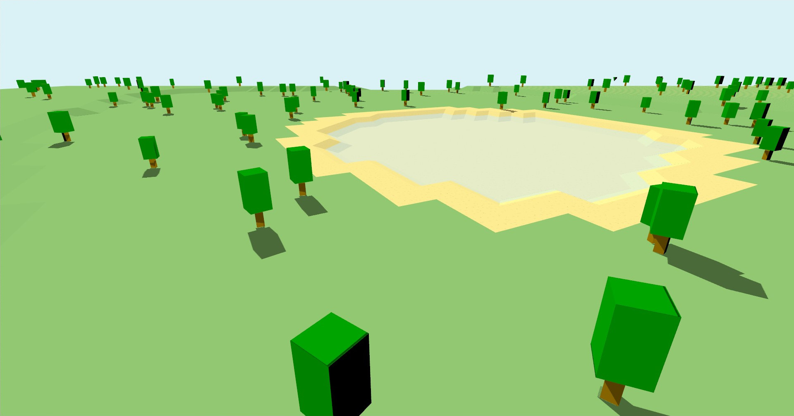

# City Builder Game
## Overview
A simple city-building game using C++ and OpenGL.
### Features
- [x] GUI
- [x] Street placement
- [ ] Traffic
- [ ] Buildings
- [ ] Savegames
- ...
---
## Getting started
### Check the requirements
Requirements:
- CMake 3.20
- C++ 20
- OpenGL 4.5

Packages:
- [glm](https://github.com/g-truc/glm)
- [glfw](https://github.com/glfw/glfw)
- [glew](https://github.com/nigels-com/glew)
- [Freetype2](https://github.com/ubawurinna/freetype-windows-binaries)
- [stb image](https://github.com/nothings/stb/blob/master/stb_image.h)
- [entt](https://github.com/skypjack/entt)
- [pugixml](https://github.com/zeux/pugixml)

### Clone the repository
    git clone https://github.com/PhiGei2000/CityBuildingGame.git

Change your current directory to the downloaded project

    cd ./CityBuilderGame

### Run CMake to build the project

    cmake --build ./build

After that keep sure you link or copy the res directory to the build directory

    cp -r ./res ./build/

or

    cd ./build && ln -s ../res res

### Start the game

    ./cityBuilderGame

## Controls

| Button | Description |
| --- | ---|
| WASD | Move |
| QE | rotate camera left/right |
| RF | rotate camera up/down |
| ESC | Main menu |
| F3 | Enter debug mode |

## Issues
Feel free to report issues to the [issues section](https://github.com/PhiGei2000/CityBuilderGame/issues).

## License
This code is licensed under the [GNU GLP license](LICENSE)